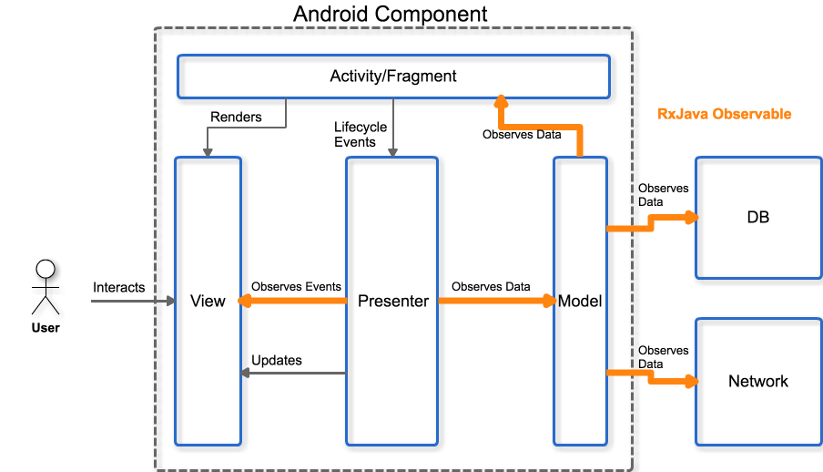

# android-rxmvp

Sample implementation of using RxJva to clean up MVP. Adding RxJava fixes the issue with a circular dependency between the view and presenter commonly seen 
other implementations of MVP.

This project uses kotlin for the profile screen so if you should add the kotlin plugin for studio to allow for syntax highlighting 
[Koltin Android Setup](https://kotlinlang.org/docs/tutorials/kotlin-android.html)